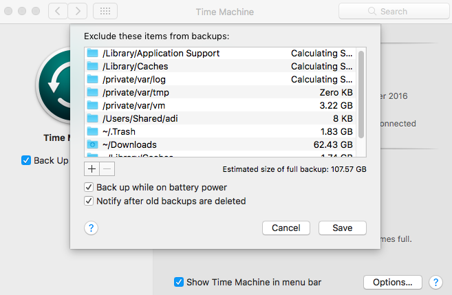

# 备份和恢复

Mac OS X下的时光机器(Time Machine) 的备份功能细颗粒度，多版本。

## 准备工作

Time Machine可以使用下面一些方式进行：

* 本地外接移动硬盘

基于速度考虑，建议使用USB 3或者雷电高速接口，硬盘的大小可以选择1T或者2T，这个硬盘将伴随着你，保护你一生的数据资料。硬盘的分区方案，参见[安装](install)部分说明

* 使用Time Capsule

无线方案，使用方便。缺点是Time Capsule发热量大，速度相对于有线方案也较慢。

## Time Machine的设置

Time Machine这么强大的功能，设置其实很简单，苹果官方网站有详细的[指南](http://support.apple.com/kb/HT1427?viewlocale=zh_CN)。

需要注意的是，Mac OS X会在运行中产生一些临时数据或者中间数据，这些数据往往占用空间较大，而没有保存价值，可以设置成exclude，常见的有：

    /Library/Application Support/
    /Library/Caches/
    /private/var/log/
    /private/var/vm/
    /private/var/tmp/
    ~/Downloads/
    ~/Library/Caches
    ~/Library/Application Support/MobileSync/
    ~/.Trash/
    ~/Documents/Virtual\ Machines.localized/
    ~/Library/Parallels

备份完毕以后，移动硬盘需要在Finder下umount才能拔出，否则有可能数据丢失。

